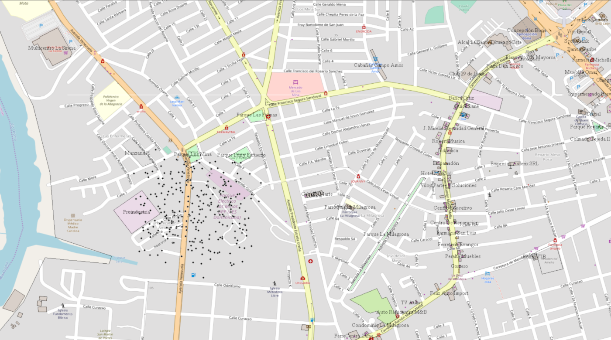
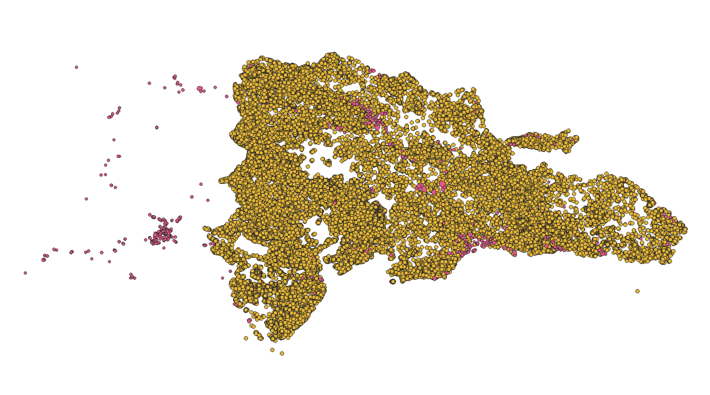

# Introducción

Los incendios forestales son un problema mundial, por lo que mediante este estudio se espera realizar un acercamiento para dar conocer a mediante el uso de análisis geoestadisticos las posibles causas de variables naturales que pueden influir en la propagación de los mismos. Mediante herramientas y data de libre acceso se pretende realizar un acercamiento que permita establecer la relación directa o indirecta sobre la problemática principal que se ha intesificado durante el 2019 según @diariolibre siendo Los parques nacionales los más quemados, el mismo establece que para los primeros meses de 2019 tuvo un incremento en los incendios Vs 2018. 
El gobierno dominicano entre las medidas preventivas previstas en cabeza del Ministerio de Medio Ambiente y Recursos Naturales, en coordinación con ministerio de Obras Publicas y el ministerio de Defensa, activó un Plan Preventivo de Emergencia (PPE) en la que se sobrevolará en helicópteros y drones las zonas vulnerables donde se producen conatos de incendio por conuquismo, con el propósito de detectar los daños en los bosques, atrapar a los culpables y actuar contra los responsables asegura @eldinero.


# Metodología

## Librerias Necesarias y adición de data

Inicialmente se usarán las siguientes librerías y el archivo para el desarrollo de los LISA cluster realizado por @profesorLisa para el desarrollo del script para la investigación 

``` {r echo=T, warning=F,message=F, eval =T}
library(sf)
library(sp)
library(raster)
library(tidyverse)
library(tmap)
library(RColorBrewer)
library(lmtest)
library(spdep)
library(parallel)
library(ggplot2)
library(gstat)
library(stars)
source('lisaclusters.R')
```

Teniendo en cuenta la información disponible se realizó la carga de la data de \textbf{incendios, municipios, y uso de suelo}, la primera de las capas fue trabajada inicialmente en QGis realizando un join de la data de VIIRS y MODIS, sin embargo se percibieron dos problemas. La cantidad de zonas de alta densidad de incendios que correspondían a canteras y zonas industriales a lo largo del país como se presenta en las Figuras 1 y en segunda instancia la notoriedad que no todos los incendios correspondian a incendios forestales.



Para el primer problema y haciendo uso de la data de la @OSM, se realizo un buffer de los centroides de los poligonos de canteras y edificios de un radio de 1.11 km o 0.01 grados teniendo en cuenta que la data se encuentra en la referencia espacial WGS84:4326  usando el archivo `gis_osm_landuse_a_free_1` eliminando todos los datos que se encontrarán dentro del mismo como se muestra en la Figura 2.




``` {r echo=F, warning=F ,message=F, eval =T, results='hide'}
#carga de capas y transformación
incendios <- st_read(dsn = "data/Incendios/FiredataBuffer.shp")
mun <- st_read(dsn = 'data/DivisionRD/divisionRD.gpkg', layer = 'MUNCENSO2010')
mun4326 <- st_transform(mun, crs = 4326)
usoSuelo <- raster('data/UsoSuelo/GLOBCOVER_RD.color.tif')
```


Para el segundo problema y haciendo uso de la data de @globcover se realizó un subset de los usos de suelo contemplando los valores entre 30 y 120 de la siguiente tabla tomada de la data descargada de GlobCover.

| Value                                                     | Label                                             |
|---------|-----------------------------------------------------------------------------------------------------|
| 11 | Post-flooding or irrigated croplands (or aquatic) |
| 14 | Rainfed croplands                        |
| 20 | Mosaic cropland (50-70%) / vegetation   (grassland/shrubland/forest) (20-50%)|
| 30 | Mosaic vegetation (grassland/shrubland/forest) (50-70%) /   cropland (20-50%)|
| 40 | Closed to open (>15%) broadleaved evergreen or   semi-deciduous forest (>5m)|
| 50 | Closed (>40%) broadleaved deciduous forest (>5m)|
| 60 | Open (15-40%) broadleaved deciduous forest/woodland (>5m)|
| 70 | Closed (>40%) needleleaved evergreen forest (>5m)|
| 90 | Open (15-40%) needleleaved deciduous or evergreen forest   (>5m)  |
| 100 | Closed to open (>15%) mixed broadleaved and needleleaved   forest (>5m)|
| 110 | Mosaic forest or shrubland (50-70%) / grassland (20-50%)|
| 120 | Mosaic grassland (50-70%) / forest or shrubland (20-50%)|
| 130 | Closed to open (>15%) (broadleaved or needleleaved,   evergreen or deciduous) shrubland (<5m)|
| 140 | Closed to open (>15%) herbaceous vegetation (grassland,   savannas or lichens/mosses)| 
| 150 | Sparse (<15%) vegetation| 
| 160 | Closed to open (>15%) broadleaved forest regularly flooded   (semi-permanently or temporarily) - Fresh or brackish water| 
| 170 | Closed (>40%) broadleaved forest or shrubland permanently   flooded - Saline or brackish water| 
| 180 | Closed to open (>15%) grassland or woody vegetation on   regularly flooded or waterlogged soil - Fresh, brackish or saline water| 
| 190 | Artificial surfaces and associated areas (Urban areas >50%)| 
| 200 | Bare areas| 
| 210 | Water bodies| 
| 220 | Permanent snow and ice| 
| 230 | No data (burnt areas, clouds,…)| 


``` {r echo=F, warning=F,message=F, eval =T, results='hide'}
#extracción de datos raster
incUsoSuelo <- raster::extract(usoSuelo, incendios,sp=TRUE)
incForestales <- subset(incUsoSuelo,incUsoSuelo$GLOBCOVER_RD.color>20
                        & incUsoSuelo$GLOBCOVER_RD.color<130)
incForestales.df <- data.frame(incForestales)
```

Se realizó una comprobación para conocer si los valores correspondían a los usados para la obtención de los datos forestales y se realizo una intersección entre la capa de incendios y la de municipios asignandole a cada dato el valor ENLACE.

``` {r echo=F, warning=F,message=F, eval =T}
summary(incForestales.df[[18]])
```


``` {r echo=F, warning=F,message=F, results='hide', eval =T}
#Adición de la cobertura 
incForestales.sf <- st_as_sf(incForestales)
incendiosForestales <- st_intersection(incForestales.sf,mun4326)
```
``` {r echo=F, warning=F,message=F, eval =T}
plot(incendiosForestales['GLOBCOVER_RD.color'])
```

Con la información resulante para cada dato, se realizó un arrange entre el numero de datos con el mismo ENLACE y se concatenó con la data de municipios permitiendo así mostrar un mapa con la cantidad de incendios por municipio.

``` {r echo=F, warning=F,message=F,results='hide', eval =T} 
#Conversion a Poligono
munInc <-arrange(mun4326, ENLACE)
munInc$NumIncendios <- c(table(incendiosForestales$ENLACE))
```
``` {r echo=F, warning=F,message=F, eval =T}
plot(munInc['NumIncendios'])
```

## Vecindad

Para hallar los vecinos, se debe convertir la capa de Incedios por Municipio a `SpatialPolygonsDataFrame`, y basado en el anterior se crea un objeto de vecindad por contigüidad usando el criterio `queen`, dandonos como resultado el mapa de vinculos de vecindad de cada municipio, 

``` {r echo=F, warning=F,message=F,results='hide', eval =T} 
#Vecindad
munInc.sp <- as_Spatial(munInc)
row.names(munInc.sp) <- as.character(munInc.sp$TOPONIMIA)
munInc.nb <- poly2nb(munInc.sp, queen = TRUE)
```
``` {r echo=F, warning=F,message=F, eval =T}
plot(munInc.sp, border="grey", lwd=0.5)
plot(munInc.nb, coordinates(munInc.sp), add=T)
```

Sin embargo se debe hallar los vinculos de vecindad entre los municipios para lo que se usa su vecino mas proximo

``` {r echo=F, warning=F,message=F,results='hide', eval =T} 
#Num Vecinos
coords <- coordinates(munInc.sp)
ident <- row.names(munInc.sp)
munInc.nb.k1 <- knn2nb(knearneigh(coords, k = 1), row.names = ident)
```
``` {r echo=F, warning=F,message=F, eval =T}
plot(munInc.sp, border="grey", lwd=0.5)
plot(munInc.nb.k1, coordinates(munInc.sp), add=T)
```

Basandose en el mapa resultante se visualizan los datos estadísticos descriptivos sobre las distancias entre los municipios permitiendo determinar los valores extremos (mínimo y máximo) de distancias a vecinos más próximos.

``` {r echo=F, warning=F,message=F,results='hide', eval =T} 
dist <- unlist(nbdists(munInc.nb.k1, coords))
distmin <- min(dist) 
distmax <- max(dist)
indicemin <- which(distmin==dist)
indicemax <- which(distmax==dist)
```
``` {r eval =T}
summary(dist)
hist(dist)
boxplot(dist)
```

A continuación deben asignarse los pesos espaciales utilizando el estilo *weighted* o "W", donde los pesos de las observaciones vecinas a una observación dada, suman 1, asignando pesos homogéneos a cada vecino, sin embargo se realizará tambien al estilo binario. [@bivand2008applied], bajo el cual el objeto *j* recibe un peso de *1* ante el objeto *i*, siempre que el primero sea vecino del primero; por el contrario, si *k* no es vecino de *i* recibe un peso de 0 por ante *i*. Los pesos son indicativos de la fortaleza de la relación entre dos o más observaciones.

``` {r echo=F, warning=F,message=F,results='hide', eval =T} 

#Ponderadores espaciales
munInc.w.W <- nb2listw(munInc.nb)
munInc.w.B <- nb2listw(munInc.nb, style = 'B')
```
``` {r eval =T}
munInc.w.W 
```
``` {r eval =T}
munInc.w.B
```

## Autocorrelación espacial

Para trabajar en la autocorrelación espacial se decide generar varias columnas entre las que se encuentran *porcentaje de incendios* y *porcentaje por km2* a su vez y puesto que existen municipios mas grandes que otros y esto puede generar valores erroneos para el estudio se generan una columna  de *incendios por area*, sin embargo para efectos de estudio se genera una columna usando el *logaritmo*, *Ladder of Powers (escalera de potencias de Tukey)* y *tukey_lamda*

``` {r echo=F, warning=F,message=F, eval =T} 
#Correlacion Incendios
munIncPercGeom <- munInc %>%st_centroid() %>%  mutate( 
  'IncPercentage' = munInc$NumIncendios/sum(munInc$NumIncendios)*100,
  'IncPercentage_log' = log1p(munInc$NumIncendios/sum(munInc$NumIncendios)*100),
  'IncPercentage_tukey' = rcompanion::transformTukey(
                NumIncendios/sum(munInc$NumIncendios)*100, plotit = F),
  'IncPercentage_tukey_lambda' = rcompanion::transformTukey(
                NumIncendios/sum(munInc$NumIncendios)*100, returnLambda = T),
  'AreaKm2' = as.numeric((st_area(munInc)/1000000)),
  'IncXArea' = (munInc$NumIncendios/AreaKm2),
  'IncXArea_log' = log1p(munInc$NumIncendios/AreaKm2),
  'IncXArea_tukey' = rcompanion::transformTukey(NumIncendios/
                                                  AreaKm2, plotit = F),
  'IncXArea_tukey_lambda' = rcompanion::transformTukey(
                                NumIncendios/AreaKm2, returnLambda = T),
  x=unlist(map(geom,1)), y=unlist(map(geom,2))) 
```

Teniendo en cuenta los resultados se genera el poligono realizando una union entre Incendios por Municipio y la tabla resultante anterior.

``` {r echo=F, warning=F,message=F,results='hide', eval =T} 
munIncPerc <-  munIncPercGeom %>%st_drop_geometry() 

#Join 
munIncPercPol <- munInc %>%
  merge(munIncPerc, all.y=TRUE)
```


Basandose en la capa resultante se realizan dos mapas que representan los porcentajes de incendios por cada municipio sin importar el área mostrando a los municipios del sur oeste y San Juan como los de mayor tasa de incendios.

``` {r echo=F, warning=F,message=F,results='hide', eval =T} 
#Mapa Porcentajes
p1 <- tm_shape(munIncPercPol) +
  tm_fill(col = "IncPercentage", style = 'jenks',
          palette = brewer.pal(9, name = 'Reds'),
          title = 'Porcentaje Incendios') +
          tm_borders(lwd = 0.5)

p2 <- tm_shape(munIncPercPol) +
  tm_fill(col = "IncPercentage_log", style = 'jenks',
          palette = brewer.pal(9, name = 'Reds'),
          midpoint = NA, 
          title = 'Porcentaje Incendios') +
          tm_borders(lwd = 0.5)
```

``` {r echo=F, warning=F,message=F, eval =T} 
tmap_arrange(p1,p2)
```

Al realizar las pruebas de "Shapiro-Wilk" para las columnas *Porcentaje de Incendios*, *Log Porcentaje de Incendios* y *Tukey Porcentaje de Incendios* se observa que tan solo la ultima tiene valores p mayores a 0.05 por lo que no permite su rechazo y se considera el supuesto de normalidad. Al realizar la prueba "Breusch-Pagan" para cada una de estas todas las variables tienen resultados que pueden ser interpretados con una hipotesis nula que no puede ser rechazada y con presunción de homocedastisidad esto debido a que todas superan el p mayor a 0.05.

``` {r warning=F,message=F, eval =T} 

#qq 
qqnorm(munIncPerc$IncPercentage)
shapiro.test(munIncPerc$IncPercentage)

qqnorm(munIncPerc$IncPercentage_log)
shapiro.test(munIncPerc$IncPercentage_log)

qqnorm(munIncPerc$IncPercentage_tukey)
shapiro.test(munIncPerc$IncPercentage_tukey)

munIncPerc %>% lm(IncPercentage ~ x, .) %>% bptest()
munIncPerc %>% lm(IncPercentage ~ y, .) %>% bptest()
munIncPerc %>% lm(IncPercentage_log ~ x, .) %>% bptest()
munIncPerc %>% lm(IncPercentage_log ~ y, .) %>% bptest()
munIncPerc %>% lm(IncPercentage_tukey ~ x, .) %>% bptest()
munIncPerc %>% lm(IncPercentage_tukey ~ y, .) %>% bptest()

```
Teniendo en cuenta los resultados anteriores, se evalua la *autocorrelación espacial global* teniendo en cuenta la prueba para la "I" de Moran usando los pesos estandarizados y los binarios para la variable de *Tukey* estableciendo que las comprobaciónes son menores al alpha estipulado permitiendo afirmar al estudio que existe una autocorrelación espacial.

``` {r warning=F,message=F, eval =T} 
(gmoranw <- moran.test(x = munIncPerc$IncXArea_tukey, listw = munInc.w.W ))
(gmoranb <- moran.test(x = munIncPerc$IncXArea_tukey, listw = munInc.w.B))

moran.plot(x = munIncPerc$IncPercentage_tukey, listw = munInc.w.W)
```

Finalmente se realiza el mapa de LISA Cluster para la variable *Porcentaje de incendios Tukey* arrojando el siguiente resultado que permite observar que los municipios con correlación espacial para los incendios son San Juan, Higuey y Neiba.

``` {r echo=F, warning=F,message=F, eval =T} 
lisamap(objesp = munIncPercPol,
        var = 'IncPercentage_tukey',
        pesos = munInc.w.W,
        tituloleyenda = 'Significancia\n(
                        "x-y",léase\ncomo "x"\nrodeado de "y"',
        leyenda = T,
        anchuratitulo = 1000,
        tamanotitulo = 16,
        fuentedatos = '',
        titulomapa = paste0('Clusters LISA de Porcentaje 
                            de Incendios Forestales (Tukey Trans.)'))

```

Para efectos del estudio se repite el proceso descrito anteriormente para las mismas variables sin embargo teniendo en cuenta el "área" de los municipios esto debido a los resultados vistos en el LISA Cluster.

``` {r echo=F, warning=F,message=F,results='hide', eval =T} 
# Mapa Porcentaje por Km2
p3 <- tm_shape(munIncPercPol) +
          tm_fill(col = "IncXArea", style = 'jenks',
          palette = brewer.pal(9, name = 'Reds'), 
          title = 'Porcentaje Incendios por Km2') +
          tm_borders(lwd = 0.5)
p4 <- tm_shape(munIncPercPol) +
          tm_fill(col = "IncXArea_log", style = 'jenks',
          palette = brewer.pal(9, name = 'Reds'),
          title = 'Porcentaje Incendios por Km2') +
          tm_borders(lwd = 0.5)

```

Teniendo en cuenta que los mapas mostrados a continuación se enfocan en la cantidad de incendios por km2 se puede observar que los municipios con mayor cantidad de incendios son los municipios fronterizos de orografía pronunciada.

``` {r echo=F, warning=F,message=F, eval =T} 
tmap_arrange(p3,p4)
```

Al realizar las pruebas de "Shapiro-Wilk" para las columnas *Porcentaje de Incendios x Area *, *Log Porcentaje de Incendios x Area* y *Tukey Porcentaje de Incendios x Area* se observa que tan solo la ultima tiene valores p mayores a 0.05 por lo que no permite su rechazo y se considera el supuesto de normalidad. Al realizar la prueba "Breusch-Pagan" para cada una de estas todas las variables tienen resultados que pueden ser interpretados con una hipotesis nula que no puede ser rechazada y con presunción de homocedastisidad esto debido a que todas superan el p mayor a 0.05.

``` {r warning=F,message=F, eval =T} 
#qq 
qqnorm(munIncPerc$IncXArea)
shapiro.test(munIncPerc$IncXArea)

qqnorm(munIncPerc$IncXArea_log)
shapiro.test(munIncPerc$IncXArea_log)

qqnorm(munIncPerc$IncXArea_tukey)
shapiro.test(munIncPerc$IncXArea_tukey)

munIncPerc %>% lm(IncXArea ~ x, .) %>% bptest()
munIncPerc %>% lm(IncXArea ~ y, .) %>% bptest()
munIncPerc %>% lm(IncXArea_log ~ x, .) %>% bptest()
munIncPerc %>% lm(IncXArea_log ~ y, .) %>% bptest()
munIncPerc %>% lm(IncXArea_tukey ~ x, .) %>% bptest()
munIncPerc %>% lm(IncXArea_tukey ~ y, .) %>% bptest()
```

Teniendo en cuenta los resultados anteriores, se evalua la *autocorrelación espacial global* teniendo en cuenta la prueba para la "I" de Moran usando los pesos estandarizados y los binarios para la variable de *Tukey* estableciendo que las comprobaciónes son menores al alpha estipulado permitiendo afirmar al estudio que existe una autocorrelación espacial.

``` {r warning=F,message=F, eval =T} 

(gmoranw <- moran.test(x = munIncPerc$IncXArea_tukey, listw = munInc.w.W ))
(gmoranb <- moran.test(x = munIncPerc$IncXArea_tukey, listw = munInc.w.B))

moran.plot(x = munIncPerc$IncPercentage_tukey, listw = munInc.w.W)

```

Finalmente se realiza el mapa de LISA Cluster para la variable *Porcentaje de incendios x Area Tukey* arrojando el siguiente resultado que permite observar que los municipios con correlación espacial para los incendios teniendo en cuenta su área son Loma de Cabrera y Polo.


``` {r echo=F, warning=F,message=F, eval =T} 
lisamap(objesp = munIncPercPol,
        var = 'IncXArea_tukey',
        pesos = munInc.w.W,
        tituloleyenda = 'Significancia\n(
                        "x-y", léase\ncomo "x"\nrodeado de "y"',
        leyenda = T,
        anchuratitulo = 1000,
        tamanotitulo = 16,
        fuentedatos = '',
        titulomapa = paste0('Clusters LISA de Porcentaje 
                            de Incendios Forestales x Area (Tukey Trans.)'))

```


##correlación variables world clim

Para la segunda parte de esta investigación, se añaden las variables de @worldclim *Precipitación* *Viento* *Temperatura Promedio* y *Radiación Solar*, a la información de los Incendios Forestales asi como las columnas de *mes*, *año* y *Id unico*. Cabe notar que la data de "WorldClim" se establece basandose un promedio mensual en el periodo 1970-2000 

# * Stack

``` {r echo=F, warning=F,message=F,results='hide', eval =T} 

# * Add month and Year field
incendiosForestales$month <- format(as.Date(incendiosForestales$ACQ_DATE), "%m")
incendiosForestales$year <- strtoi(format(as.Date(
                            incendiosForestales$ACQ_DATE), "%Y"))
hist(incendiosForestales$year)
# * Add unique field
incendiosForestales$unique <- 1:nrow(incendiosForestales)
```

@profesorData realizó el script de adición de data basandose en la localización del incendio y el mes de adquisición por parte de la NASA por cada una de las variables a estudiar dando como resultado el archivo `puntos_calor_fuegos_y_worldclim_viento_temp_radiacion`. Sin embargo este script necesita de una unidad de computo de altas prestaciones por lo que es recomendable no realizar dicho procedimiento en equipos con menos de 64Gb de memoria RAM y multiples cores para su procesamiento.

``` {r echo=F, warning=F,message=F,results='hide', eval =F} 
wclayerspath <- list.files(path = 'data/WorldClim/', 
                           pattern = '*.tif', recursive = T, full.names = T)
wcstack <- stack(wclayerspath)

# * Extract values from WC corresponding to the month of each point
system.time(
  foo <- sapply(1:20, function(x) {
    sp <- incendiosForestales[x,]
    m <- ifelse(nchar(sp$month)==1, paste0('0', sp$month), sp$month)
    e <- raster::extract(wcstack[[grep(paste0(m,'$'), names(wcstack))]],
                                  sp, sp=T)
    d <- e@data[,c('unique', 'month', 
                   grep('RD_wc2.*', colnames(e@data), value = T))]
    return(d)
  }, simplify = F)
)
#Laptop 8 cores, 8 GB
#   user  system elapsed 
# 20.801   0.008  20.807
#Workstation, 8 cores, 64 GB
#  user  system elapsed 
# 12.036   0.012  12.047 
bar <- inner_join(incendiosForestales, bind_rows(foo), by = c('unique', 'month'))
bar

#Parallel
UseCores <- detectCores() - 1
cl <- makeCluster(UseCores, outfile=paste0('info_parallel.log'))
clusterExport(cl, list('incendiosForestales', 'wcstack'))
system.time(
  foo <- parSapply(cl, 1:20, function(x) {
    sp <- sf::as_Spatial(incendiosForestales[x,])
    m <- ifelse(nchar(sp$month)==1, paste0('0', sp$month), sp$month)
    e <- raster::extract(wcstack[[grep(paste0(m,'$'), names(wcstack))]],
                                  sp, sp=T)
    d <- e@data[,c('unique', 'month', grep('RD_wc2.*', 
                                           colnames(e@data), value = T))]
    return(d)
  }, simplify = F)
)
#Laptop 8 cores, 8 GB
#  user  system elapsed 
# 0.009   0.008   2.775
#Workstation, 8 cores, 64 GB
#  user  system elapsed 
# 0.009   0.000   1.552 
#Estimated entire job:
1.552/20*nrow(incendiosForestales)/60
# [1] 60.96256
stopCluster(cl)
bar <- inner_join(incendiosForestales, bind_rows(foo), 
                      by = c('unique', 'month'))
bar
#

#Parallel
UseCores <- detectCores() - 1
cl <- makeCluster(UseCores, outfile=paste0('info_parallel.log'))
clusterExport(cl, list('incendiosForestales', 'wcstack'))

## Not run: 
system.time(
  foo <- parSapply(cl, 1:nrow(incendiosForestales), function(x) {
    sp <- sf::as_Spatial(incendiosForestales[x,])
    m <- ifelse(nchar(sp$month)==1, paste0('0', sp$month), sp$month)
    e <- raster::extract(wcstack[[grep(paste0(m,'$'), names(wcstack))]],
                                  sp, sp=T)
    d <- e@data[,c('unique', 'month', grep('RD_wc2.*', colnames(e@data),
                                           value = T))]
    return(d)
  }, simplify = F)
)
## End(Not run)
#Workstation, 8 cores, 64 GB

stopCluster(cl)
bar <- inner_join(incendiosForestales, bind_rows(foo), 
                  by = c('unique', 'month'))
bar
```

Para efectos prácticos, se realizó el mismo procedimiento usando la herramienta QGis mediante el `plugin point sampling tool` estableciendo el valor de todas las variables climaticas para cada incendio, el *mes* y *ID unico* obteniendo una tabla que fue exportada con formato "CSV". La misma se abre en el software "Openoffice Calc" y por medio la funcion "Buscar" para la matriz estableciendo el valor para cada incendio tomando en cuenta el valor del mes. 

Con el resultado anterior se realiza un *left join* con la tabla inicial de incendios forestales usando como punto de enlace el valor "ID Unico"
Posteriormente se quitan los valores que obtuvieron como valor 0 debido a que estos son errores puesto que se conoce que en el país no existe ese valor para ninguna de las variables.

``` {r echo=F, warning=F,message=F,results='hide', eval =T} 
#extracción de datos raster

tablaWorldClim <- read.table("data/Incendios/Test2.csv", 
                 header = TRUE,
                 sep = ",")

incForWorldClim <- left_join(incendiosForestales, 
                             select(tablaWorldClim,
                                    c(unique,month,wind,temp,srad,prec)),
                             by = 'unique')
```
Teniendo en cuenta el siguiente gráfico se decide un valor promedio de basandose en el año, puesto que el manejo de todos los datos se torna complicado con una máquina con prestaciones insuficientes ademas para poder realizar las pruebas "Saphiro-Wilk" las cuales no se pueden realizar con mas de 5000 datos.

```{r echo=F, warning=F,message=F,eval =T} 
hist(incendiosForestales$year)
```
Basandose en lo descrito anteriormente y se establece el 2018 como el año con el que se puede realizar una mejor estimación ademas cuenta con 4374 datos.

```{r echo=F, warning=F,message=F,results='hide', eval =T} 
#quitar valores 0
incForestWorldClim <- incForWorldClim[incForWorldClim$srad != 0 
                                      & incForWorldClim$prec != 0, ] 

#Segmentacion por año
incForestWC2018 <- incForWorldClim[incForWorldClim$year == 2018, ] 
incForWC2018 <- incForestWC2018[incForestWC2018$srad != 0 
                                & incForestWC2018$prec != 0, ] 
```

Se obtienen los datos estadísticos para el añó 2018
``` {r echo=T, warning=F,message=F, eval =T} 
#Año 2018
#EDA
nrow(incForWC2018)
summary(incForWC2018$prec)
summary(incForWC2018$wind)
summary(incForWC2018$srad)
summary(incForWC2018$temp)
```

Se realiza la prueba "Shapiro-Wilk" para las cuatro variables y su logaritmo sin embargo se puede observar que ninguna pasa la prueba puesta que ninguna supera el valor de 0.05, sin embargo se realiza un ploteo informativo de la variable basado en la localización de los incendios.

```{r warning=F,message=F, eval =T} 
#Temperatura
hist(incForWC2018$prec)
shapiro.test(incForWC2018$temp)
shapiro.test(log(incForWC2018$temp))
ggplot() +
  geom_sf(data = mun4326, fill = 'white') +
  geom_sf(data = incForWC2018, aes(col = temp), size = 3) +
  scale_colour_gradient(low="#f7dede", high="#ff0011") +
  geom_sf_text(data = incForWC2018, aes(label=MUN), 
               check_overlap = T, size = 0.5) +
  theme_bw()

#Radiacion Solar
shapiro.test(incForWC2018$srad)
shapiro.test(log(incForWC2018$srad))
ggplot() +
  geom_sf(data = mun4326, fill = 'white') +
  geom_sf(data = incForWC2018, aes(col = srad), size = 3) +
  scale_colour_gradient(low="#f7dede", high="#ff0011") +
  geom_sf_text(data = incForWC2018, aes(label=MUN),
               check_overlap = T, size = 0.5) +
  theme_bw()

#Viento
shapiro.test(incForWC2018$wind)
shapiro.test(log(incForWC2018$wind))
ggplot() +
  geom_sf(data = mun4326, fill = 'white') +
  geom_sf(data = incForWC2018, aes(col = wind), size = 3) +
  scale_colour_gradient(low="#deebf7", high="#3182bd") +
  geom_sf_text(data = incForWC2018, aes(label=MUN), 
               check_overlap = T, size = 0.5) +
  theme_bw()

#Precipitacion
shapiro.test(incForWC2018$prec)
shapiro.test(log(incForWC2018$prec))
ggplot() +
  geom_sf(data = mun4326, fill = 'white') +
  geom_sf(data = incForWC2018, aes(col = prec), size = 3) +
  scale_colour_gradient(low="#deebf7", high="#3182bd") +
  geom_sf_text(data = incForWC2018, aes(label=MUN),
               check_overlap = T, size = 0.5) +
  theme_bw()
```
 
Se realiza un variograma del modelo para cada una de las variables y de esta manera establecer cual podría ser el que se utilizará para el desarrollo de la interpolación "krige". A continuación se detalla para cada una de las variables.

```{r echo=F, warning=F,message=F,results='hide', eval =T} 
#variograma 
#Radiacion Solar
vsrad18 <- variogram(srad~1, incForWC2018)
vsrad18_m1 <- fit.variogram(vsrad18, vgm(model = "Exp", range = 5))
```
Radiacion Solar

```{r warning=F,message=F, eval =T} 
plot(vsrad18, plot.numbers = T)
vsrad18_m1
plot(vsrad18, vsrad18_m1, plot.numbers = T)

```

```{r echo=F, warning=F,message=F,results='hide', eval =T} 
#Temperatura
vtemp18 <- variogram(temp~1, incForWC2018)
vtemp18_m1 <- fit.variogram(vtemp18, vgm(model = "Exp", range = 50))
```
Temperatura

```{r warning=F,message=F, eval =T} 
plot(vtemp18, plot.numbers = T)
vtemp18_m1
plot(vtemp18, vtemp18_m1, plot.numbers = T)
attr(vtemp18_m1, 'SSErr')
```

```{r echo=F, warning=F,message=F,results='hide', eval =T} 
#Viento
vwind18 <- variogram(wind~1, incForWC2018)
vwind18_m1 <- fit.variogram(vwind18, vgm(model = "Lin", range = 50))
vwind18_m2 <- fit.variogram(vwind18, vgm(model = "Exp", range = 50))
vwind18_m3 <- fit.variogram(vwind18, vgm(model = "Pow", range = 1))
```
Viento 
```{r warning=F,message=F, eval =T} 
plot(vwind18, plot.numbers = T)
vwind18_m1
plot(vwind18, vwind18_m1, plot.numbers = T)
vwind18_m2
plot(vwind18, vwind18_m2, plot.numbers = T)
vwind18_m3
plot(vwind18, vwind18_m3, plot.numbers = T)

attr(vwind18_m1, 'SSErr')
attr(vwind18_m2, 'SSErr')
attr(vwind18_m3, 'SSErr') #***
```

```{r echo=F, warning=F,message=F,results='hide', eval =T} 
#Precipitacion
vprec18 <- variogram(prec~1, incForWC2018)
vprec18_m1 <- fit.variogram(vprec18, vgm(model = "Pen", range = 5000))
```

Precipitación
```{r warning=F,message=F, eval =T} 
plot(vprec18, plot.numbers = T)
vprec18_m1
plot(vprec18, vprec18_m1, plot.numbers = T)

```
Teniendo en cuenta los resultados obtenidos, se visualiza que el modelo No.3 para el viento basado en el modelo *Pow (power)* es el que da mejor resultado por lo cual será utilizado para el modelo de interpolación "Krige" para esto se genera una grilla de 10km y se realiza una transformación a UTM19N:32619 para poder realizar el modelo.

```{r echo=F, warning=F,message=F,results='hide', eval =T} 
## Loading required package: abind
grd <- st_bbox(mun) %>%
  st_as_stars(dx = 10000) %>% #10000 metros=10km de resolución espacial
  st_crop(mun)
grd
grd4326 <- st_transform(grd, crs = 4326)
plot(grd4326)

incForWC2018.32619 <- st_transform(incForWC2018, crs = 32619)
k <- krige(formula = wind~1, locations = incForWC2018.32619, 
           newdata = grd, model = vwind18_m3)
```
```{r echo=F, warning=F,message=F, eval =T} 
#krigging
plot(k)
```
Como resultado del modelo "Krige" se obtiene el siguiente modelo para el pais basado en los vientos.
```{r echo=F, warning=F,message=F, eval =T} 
ggplot() +
  geom_stars(data = k, aes(fill = var1.pred, x = x, y = y)) + 
  scale_fill_gradient(low="#deebf7", high="#3182bd") +
  geom_sf(data = st_cast(mun, "MULTILINESTRING")) +
  geom_sf(data = incForWC2018) +
  geom_sf_text(data = mun, aes(label=TOPONIMIA), check_overlap = T, size = 0.8)+
  theme_bw()
```

Por ultimo se realiza un modelo de predicción teniendo en cuenta el modelo basandose en un modelo digital de elevaciones para buscar las zonas mas propensas teniendo en cuenta los incendios y la elevación para cada uno de los puntos. 

```{r echo=F, warning=F,message=F,results='hide', eval =T} 
#DEM
nrow(munIncPerc)
```
Teniendo en cuenta los datos para el numero de incendios se observa que mediante la modificación de los datos usando un logaritmo se estandarizan un poco permitiendo realizar un modelo mas cercano a la realidad.

```{r warning=F,message=F, eval =T} 
hist(munIncPerc$NumIncendios)
qqnorm(munIncPerc$NumIncendios)
shapiro.test(munIncPerc$NumIncendios)

hist(log(munIncPerc$NumIncendios))
qqnorm(log(munIncPerc$NumIncendios))
shapiro.test(log(munIncPerc$NumIncendios))
```
Visto desde un mapa se representa de la siguiente manera
```{r echo=F, warning=F,message=F, eval =T} 
ggplot() +
  geom_sf(data = mun4326, fill = 'white') +
  geom_sf(data = munIncPercGeom, aes(col = NumIncendios), size = 6) + 
  scale_colour_gradientn(colours = rev(brewer.pal(9, name = 'RdBu'))) +
  geom_sf_text(data = munIncPercGeom, aes(label=TOPONIMIA), 
               check_overlap = T, size = 2) +
  theme_bw()
```

Se carga el modelo digital de elevación y se asignan los valores de elevación para cada incendio, ademas se remuestrea el valor basandose en la cuadricula de 10km realizada anteriormente, esta misma sirve para predecir los valores de incendios.
```{r echo=F, warning=F,message=F,results='hide', eval =T} 
#dem
dem <- read_stars('data/DTM/dem_srtm_remuestreado.tif')
names(dem) <- 'ele'
dem4326 <- st_transform(dem, crs = 4326)
grdcovars <- aggregate(dem, grd, mean, na.rm=T) %>% st_transform(crs = 4326)

munIncPercGeom$ele <- st_as_sf(aggregate(grdcovars, munIncPercGeom, mean))[[1]]
munIncPercGeom <- munIncPercGeom [!is.na(munIncPercGeom$ele),]
```
Se observa en el siguiente gráfico que la mayoría de incendios se presentan en elevaciones menores a 500m.

```{r echo=F, warning=F,message=F, eval =T} 
plot(munIncPercGeom$NumIncendios, munIncPercGeom$ele)
```

```{r echo=F, warning=F,message=F,results='hide', eval =T} 
munIncPercGeom_lm <- lm(NumIncendios ~ ele, munIncPercGeom)
```

```{r echo=T, warning=F,message=F, eval =T} 
summary(munIncPercGeom_lm)
plot(munIncPercGeom_lm)
```
Se necesita que los datos de elevación pasen al objeto Incendios, para probar un modelo lineal que ponga en relación a los datos por lo que se prueban diferentes modelos.

```{r echo=T, warning=F,message=F,eval =T} 
vt <- variogram(NumIncendios ~ ele, munIncPercGeom)
vt
plot(vt)

vt_m <- fit.variogram(vt, vgm(model = "Exp", range = 50))
vt_m
plot(vt, vt_m, plot.numbers = T)

vt_m2 <- fit.variogram(vt, vgm(model = "Pen", range = 50))
vt_m2
plot(vt, vt_m2, plot.numbers = T)

vt_m3 <- fit.variogram(vt, vgm(model = "Sph", range = 50))
vt_m3
plot(vt, vt_m3, plot.numbers = T)
```
Teniendo en cuenta que el modelo mas ajustado es el modelo basado al modelo "Exponencial" se realiza el modelo de predicción de las zonas mas vulnerables para la propagación de incendios forestales.

```{r echo=F, warning=F,message=F,results='hide', eval =T} 
k_u <- krige(NumIncendios ~ ele , munIncPercGeom, 
             st_rasterize(st_as_sf(grdcovars)), vt_m)
```

```{r echo=F, warning=F,message=F, eval =T} 
ggplot() +
  geom_stars(data = k_u, aes(fill = var1.pred, x = x, y = y)) + 
  scale_fill_gradientn(colours = rev(brewer.pal(9, name = 'RdBu'))) +
  geom_sf(data = st_cast(mun4326, "MULTILINESTRING")) +
  geom_sf(data = munIncPercGeom) +
  geom_sf_text(data = mun4326, aes(label=TOPONIMIA), check_overlap = T, 
               size = 1) +
  theme_bw()
```


# Resultados

Es de notar que a lo largo del estudio realizado se observa que los municipios mas cercanos a la frontera tienen un comportamiento similar sin importar la variable a correlacionarse, se observó que al realizar el procesamiento mediante el método LISA Cluster los municipios de San Juan, Higuey y Neiba inicialmente presentan un alto indice de incendios, sin embargo al tener en cuenta el área de los municipios, los municipios del este del pais no tienen una tasa tan alta y arroja que Loma de Cabrera y Polo son los que tienen mayor indice de incendios. 
Por otro lado, al realizar el Kriging universal teniendo en cuenta la relación elevación/incendios se observa que los municipios cercanos a la frontera y en zona montañosa tienen un alto indice de propagación de incendios, ademas de estos se tienen dos datos facilmente explicables, para al municipio de Bayaguana el cual basa su economia en ganadería y campos arroceros se puede establecer que teniendo en cuenta que la forma mas sencilla y económica para expandir las áreas para dichas labores es la quema de bosque, asi mismo se comporta el municipio de Higuey en donde los complejos turísticos pueden tener un comportamiento similiar. 

# Discusión o Conclusiones

Es recomendable realziar un estudio teniendo en cuenta los factores sociales puesto que estos pueden ser un factor influyente en la propagación de incendios para la República Dominicana


# Información de soporte

Para el desarrollo de este trabajo se usó la siguiente información

- Incendios forestales @firmsdw (Información de los ultimos 10 años para el pais)
- Variables climaticas @WorldClim (2.5m)
    - Temperatura Promedio (Cº)
    - Precipitacion (mm)
    - Radiación Solar (Kj m-2 day-1)
    - Velocidad del viento (m s-1)
- Elevaciones DTM entregado por @profesorClase
- Uso de suelo @globcover
- OpenStreetMaps @OSM

# *Script* reproducible

```{r echo=T, warning=F,message=F,results='hide', eval =F} 
library(sf)
library(sp)
library(raster)
library(tidyverse)
library(tmap)
library(RColorBrewer)
library(lmtest)
library(spdep)
library(parallel)
library(ggplot2)
library(gstat)
library(stars)
source('lisaclusters.R')

#carga de capas y transformación
incendios <- st_read(dsn = "data/Incendios/FiredataBuffer.shp")
mun <- st_read(dsn = 'data/DivisionRD/divisionRD.gpkg', layer = 'MUNCENSO2010')
mun4326 <- st_transform(mun, crs = 4326)
usoSuelo <- raster('data/UsoSuelo/GLOBCOVER_RD.color.tif')

#extracción de datos raster
incUsoSuelo <- raster::extract(usoSuelo, incendios,sp=TRUE)
incForestales <- subset(incUsoSuelo,incUsoSuelo$GLOBCOVER_RD.color>20
                        & incUsoSuelo$GLOBCOVER_RD.color<130)
incForestales.df <- data.frame(incForestales)
summary(incForestales.df[[18]])

#Adición de la cobertura 
incForestales.sf <- st_as_sf(incForestales)
incendiosForestales <- st_intersection(incForestales.sf,mun4326)
plot(incendiosForestales['GLOBCOVER_RD.color'])


#Conversion a Poligono
table(incendiosForestales$ENLACE)
munInc <-arrange(mun4326, ENLACE)
munInc$NumIncendios <- c(table(incendiosForestales$ENLACE))
plot(munInc['NumIncendios'])

#Vecindad
munInc.sp <- as_Spatial(munInc)
colnames(munInc.sp@data)
row.names(munInc.sp) <- as.character(munInc.sp$TOPONIMIA)
munInc.nb <- poly2nb(munInc.sp, queen = TRUE)
summary(munInc.nb)
plot(munInc.sp, border="grey", lwd=0.5)
plot(munInc.nb, coordinates(munInc.sp), add=T)

#Num Vecinos
coords <- coordinates(munInc.sp)
ident <- row.names(munInc.sp)
munInc.nb.k1 <- knn2nb(knearneigh(coords, k = 1), row.names = ident)
summary(munInc.nb.k1)

card(munInc.nb.k1)
plot(munInc.sp, border="grey", lwd=0.5)
plot(munInc.nb.k1, coordinates(munInc.sp), add=T)
is.symmetric.nb(munInc.nb.k1)
dist <- unlist(nbdists(munInc.nb.k1, coords))
summary(dist)
hist(dist)
boxplot(dist)
(distmin <- min(dist)) 
(distmax <- max(dist))
indicemin <- which(distmin==dist)
ident[indicemin]
indicemax <- which(distmax==dist)
ident[indicemax]
ident[order(dist)]

#Ponderadoes espaciales
munInc.w.W <- nb2listw(munInc.nb)
munInc.w.W

munInc.w.B <- nb2listw(munInc.nb, style = 'B')
munInc.w.B


#Correlacion Incendios
munIncPercGeom <- munInc %>%st_centroid() %>%  mutate( 
  'IncPercentage' = munInc$NumIncendios/sum(munInc$NumIncendios)*100,
  'IncPercentage_log' = log1p(munInc$NumIncendios/sum(munInc$NumIncendios)*100),
  'IncPercentage_tukey' = rcompanion::transformTukey(
                NumIncendios/sum(munInc$NumIncendios)*100, plotit = F),
  'IncPercentage_tukey_lambda' = rcompanion::transformTukey(
                NumIncendios/sum(munInc$NumIncendios)*100, returnLambda = T),
  'AreaKm2' = as.numeric((st_area(munInc)/1000000)),
  'IncXArea' = (munInc$NumIncendios/AreaKm2),
  'IncXArea_log' = log1p(munInc$NumIncendios/AreaKm2),
  'IncXArea_tukey' = rcompanion::transformTukey(NumIncendios/
                                                  AreaKm2, plotit = F),
  'IncXArea_tukey_lambda' = rcompanion::transformTukey(
                                NumIncendios/AreaKm2, returnLambda = T),
  x=unlist(map(geom,1)), y=unlist(map(geom,2))) 

munIncPerc <-  munIncPercGeom %>%st_drop_geometry() 

#Join 
munIncPercPol <- munInc %>%
  merge(munIncPerc, all.y=TRUE)

#Mapa Porcentajes
p1 <- tm_shape(munIncPercPol) +
  tm_fill(col = "IncPercentage", style = 'jenks',
          palette = brewer.pal(9, name = 'Reds'),
          title = 'Porcentaje Incendios') +
          tm_borders(lwd = 0.5)

p2 <- tm_shape(munIncPercPol) +
  tm_fill(col = "IncPercentage_log", style = 'jenks',
          palette = brewer.pal(9, name = 'Reds'),
          midpoint = NA, 
          title = 'Porcentaje Incendios') +
          tm_borders(lwd = 0.5)

tmap_arrange(p1,p2)

#qq 
qqnorm(munIncPerc$IncPercentage)
shapiro.test(munIncPerc$IncPercentage)

qqnorm(munIncPerc$IncPercentage_log)
shapiro.test(munIncPerc$IncPercentage_log)

qqnorm(munIncPerc$IncPercentage_tukey)
shapiro.test(munIncPerc$IncPercentage_tukey)

munIncPerc %>% lm(IncPercentage ~ x, .) %>% bptest()
munIncPerc %>% lm(IncPercentage ~ y, .) %>% bptest()
munIncPerc %>% lm(IncPercentage_log ~ x, .) %>% bptest()
munIncPerc %>% lm(IncPercentage_log ~ y, .) %>% bptest()
munIncPerc %>% lm(IncPercentage_tukey ~ x, .) %>% bptest()
munIncPerc %>% lm(IncPercentage_tukey ~ y, .) %>% bptest()


match(attr(munInc.w.W$neighbours, "region.id"), munIncPerc$TOPONIMIA)==1:155

(gmoranw <- moran.test(x = munIncPerc$IncXArea_tukey, listw = munInc.w.W ))
(gmoranb <- moran.test(x = munIncPerc$IncXArea_tukey, listw = munInc.w.B))

moran.plot(x = munIncPerc$IncPercentage_tukey, listw = munInc.w.W)

lisamap(objesp = munIncPercPol,
        var = 'IncPercentage_tukey',
        pesos = munInc.w.W,
        tituloleyenda = 'Significancia\n(
                        "x-y",léase\ncomo "x"\nrodeado de "y"',
        leyenda = T,
        anchuratitulo = 1000,
        tamanotitulo = 16,
        fuentedatos = '',
        titulomapa = paste0('Clusters LISA de Porcentaje 
                            de Incendios Forestales (Tukey Trans.)'))

# Mapa Porcentaje por Km2
p3 <- tm_shape(munIncPercPol) +
          tm_fill(col = "IncXArea", style = 'jenks',
          palette = brewer.pal(9, name = 'Reds'), 
          title = 'Porcentaje Incendios por Km2') +
          tm_borders(lwd = 0.5)
p4 <- tm_shape(munIncPercPol) +
          tm_fill(col = "IncXArea_log", style = 'jenks',
          palette = brewer.pal(9, name = 'Reds'),
          title = 'Porcentaje Incendios por Km2') +
          tm_borders(lwd = 0.5)

tmap_arrange(p3,p4)

#qq 
qqnorm(munIncPerc$IncXArea)
shapiro.test(munIncPerc$IncXArea)

qqnorm(munIncPerc$IncXArea_log)
shapiro.test(munIncPerc$IncXArea_log)

qqnorm(munIncPerc$IncXArea_tukey)
shapiro.test(munIncPerc$IncXArea_tukey)

munIncPerc %>% lm(IncXArea ~ x, .) %>% bptest()
munIncPerc %>% lm(IncXArea ~ y, .) %>% bptest()
munIncPerc %>% lm(IncXArea_log ~ x, .) %>% bptest()
munIncPerc %>% lm(IncXArea_log ~ y, .) %>% bptest()
munIncPerc %>% lm(IncXArea_tukey ~ x, .) %>% bptest()
munIncPerc %>% lm(IncXArea_tukey ~ y, .) %>% bptest()

match(attr(munInc.w.W$neighbours, "region.id"), munIncPerc$TOPONIMIA)==1:155

(gmoranw <- moran.test(x = munIncPerc$IncXArea_tukey, listw = munInc.w.W ))
(gmoranb <- moran.test(x = munIncPerc$IncXArea_tukey, listw = munInc.w.B))

moran.plot(x = munIncPerc$IncPercentage_tukey, listw = munInc.w.W)

lisamap(objesp = munIncPercPol,
        var = 'IncXArea_tukey',
        pesos = munInc.w.W,
        tituloleyenda = 'Significancia\n(
                        "x-y", léase\ncomo "x"\nrodeado de "y"',
        leyenda = T,
        anchuratitulo = 1000,
        tamanotitulo = 16,
        fuentedatos = '',
        titulomapa = paste0('Clusters LISA de Porcentaje 
                            de Incendios Forestales (Tukey Trans.)'))

#correlación variables world clim

# * Stack
wclayerspath <- list.files(path = 'data/WorldClim/', 
                           pattern = '*.tif', recursive = T, full.names = T)
wcstack <- stack(wclayerspath)
# * Add month and Year field
incendiosForestales$month <- format(as.Date(incendiosForestales$ACQ_DATE), "%m")
incendiosForestales$year <- strtoi(format(as.Date(
                            incendiosForestales$ACQ_DATE), "%Y"))
# * Add unique field
incendiosForestales$unique <- 1:nrow(incendiosForestales)

# * Extract values from WC corresponding to the month of each point
system.time(
  foo <- sapply(1:20, function(x) {
    sp <- incendiosForestales[x,]
    m <- ifelse(nchar(sp$month)==1, paste0('0', sp$month), sp$month)
    e <- raster::extract(wcstack[[grep(paste0(m,'$'), names(wcstack))]],
                                  sp, sp=T)
    d <- e@data[,c('unique', 'month', 
                   grep('RD_wc2.*', colnames(e@data), value = T))]
    return(d)
  }, simplify = F)
)
#Laptop 8 cores, 8 GB
#   user  system elapsed 
# 20.801   0.008  20.807
#Workstation, 8 cores, 64 GB
#  user  system elapsed 
# 12.036   0.012  12.047 
bar <- inner_join(incendiosForestales, bind_rows(foo), by = c('unique', 'month'))
bar

#Parallel
UseCores <- detectCores() - 1
cl <- makeCluster(UseCores, outfile=paste0('info_parallel.log'))
clusterExport(cl, list('incendiosForestales', 'wcstack'))
system.time(
  foo <- parSapply(cl, 1:20, function(x) {
    sp <- sf::as_Spatial(incendiosForestales[x,])
    m <- ifelse(nchar(sp$month)==1, paste0('0', sp$month), sp$month)
    e <- raster::extract(wcstack[[grep(paste0(m,'$'), names(wcstack))]],
                                  sp, sp=T)
    d <- e@data[,c('unique', 'month', grep('RD_wc2.*', 
                                           colnames(e@data), value = T))]
    return(d)
  }, simplify = F)
)
#Laptop 8 cores, 8 GB
#  user  system elapsed 
# 0.009   0.008   2.775
#Workstation, 8 cores, 64 GB
#  user  system elapsed 
# 0.009   0.000   1.552 
#Estimated entire job:
1.552/20*nrow(incendiosForestales)/60
# [1] 60.96256
stopCluster(cl)
bar <- inner_join(incendiosForestales, bind_rows(foo), 
                      by = c('unique', 'month'))
bar
#

#Parallel
UseCores <- detectCores() - 1
cl <- makeCluster(UseCores, outfile=paste0('info_parallel.log'))
clusterExport(cl, list('incendiosForestales', 'wcstack'))

## Not run: 
system.time(
  foo <- parSapply(cl, 1:nrow(incendiosForestales), function(x) {
    sp <- sf::as_Spatial(incendiosForestales[x,])
    m <- ifelse(nchar(sp$month)==1, paste0('0', sp$month), sp$month)
    e <- raster::extract(wcstack[[grep(paste0(m,'$'), names(wcstack))]],
                                  sp, sp=T)
    d <- e@data[,c('unique', 'month', grep('RD_wc2.*', colnames(e@data),
                                           value = T))]
    return(d)
  }, simplify = F)
)
## End(Not run)
#Workstation, 8 cores, 64 GB


stopCluster(cl)
bar <- inner_join(incendiosForestales, bind_rows(foo), 
                  by = c('unique', 'month'))
bar
#

puntos_calor_fuegos_y_worldclim_viento_temp_radiacion


########### EASYMODE
#extracción de datos raster
#st_write(incendiosForestales, "data/Incendios/incendiosForestales.shp")

tablaWorldClim <- read.table("data/Incendios/Test2.csv", 
                 header = TRUE,
                 sep = ",")

###########END EASYMODE


incForWorldClim <- left_join(incendiosForestales, 
                             select(tablaWorldClim,
                                    c(unique,month,wind,temp,srad,prec)),
                             by = 'unique')

#quitar valores 0
incForestWorldClim <- incForWorldClim[incForWorldClim$srad != 0 
                                      & incForWorldClim$prec != 0, ] 

#Segmentacion por año
hist(incendiosForestales$year)
incForestWC2018 <- incForWorldClim[incForWorldClim$year == 2018, ] 
incForWC2018 <- incForestWC2018[incForestWC2018$srad != 0 
                                & incForestWC2018$prec != 0, ] 


#Año 2018

#EDA
nrow(incForWC2018)
summary(incForWC2018$prec)
summary(incForWC2018$wind)
summary(incForWC2018$srad)
summary(incForWC2018$temp)


#Temperatura
hist(incForWC2018$prec)
shapiro.test(incForWC2018$temp)
shapiro.test(log(incForWC2018$temp))
ggplot() +
  geom_sf(data = mun4326, fill = 'white') +
  geom_sf(data = incForWC2018, aes(col = temp), size = 3) +
  scale_colour_gradient(low="#f7dede", high="#ff0011") +
  geom_sf_text(data = incForWC2018, aes(label=MUN), 
               check_overlap = T, size = 0.5) +
  theme_bw()

#Radiacion Solar
shapiro.test(incForWC2018$srad)
shapiro.test(log(incForWC2018$srad))
ggplot() +
  geom_sf(data = mun4326, fill = 'white') +
  geom_sf(data = incForWC2018, aes(col = srad), size = 3) +
  scale_colour_gradient(low="#f7dede", high="#ff0011") +
  geom_sf_text(data = incForWC2018, aes(label=MUN),
               check_overlap = T, size = 0.5) +
  theme_bw()

#Viento
shapiro.test(incForWC2018$wind)
shapiro.test(log(incForWC2018$wind))
ggplot() +
  geom_sf(data = mun4326, fill = 'white') +
  geom_sf(data = incForWC2018, aes(col = wind), size = 3) +
  scale_colour_gradient(low="#deebf7", high="#3182bd") +
  geom_sf_text(data = incForWC2018, aes(label=MUN), 
               check_overlap = T, size = 0.5) +
  theme_bw()

#Precipitacion
shapiro.test(incForWC2018$prec)
shapiro.test(log(incForWC2018$prec))
ggplot() +
  geom_sf(data = mun4326, fill = 'white') +
  geom_sf(data = incForWC2018, aes(col = prec), size = 3) +
  scale_colour_gradient(low="#deebf7", high="#3182bd") +
  geom_sf_text(data = incForWC2018, aes(label=MUN),
               check_overlap = T, size = 0.5) +
  theme_bw()

#variograma 
#Radiacion Solar
vsrad18 <- variogram(srad~1, incForWC2018)
vsrad18_m1 <- fit.variogram(vsrad18, vgm(model = "Exp", range = 5))
plot(vsrad18, plot.numbers = T)
vsrad18_m1
plot(vsrad18, vsrad18_m1, plot.numbers = T)

#Temperatura
vtemp18 <- variogram(temp~1, incForWC2018)
vtemp18_m1 <- fit.variogram(vtemp18, vgm(model = "Exp", range = 50))
plot(vtemp18, plot.numbers = T)
vtemp18_m1
plot(vtemp18, vtemp18_m1, plot.numbers = T)
attr(vtemp18_m1, 'SSErr')

#Viento
vwind18 <- variogram(wind~1, incForWC2018)
vwind18_m1 <- fit.variogram(vwind18, vgm(model = "Lin", range = 50))
vwind18_m2 <- fit.variogram(vwind18, vgm(model = "Exp", range = 50))
vwind18_m3 <- fit.variogram(vwind18, vgm(model = "Pow", range = 1))
plot(vwind18, plot.numbers = T)
vwind18_m1
plot(vwind18, vwind18_m1, plot.numbers = T)
vwind18_m2
plot(vwind18, vwind18_m2, plot.numbers = T)
vwind18_m3
plot(vwind18, vwind18_m3, plot.numbers = T)

attr(vwind18_m1, 'SSErr')
attr(vwind18_m2, 'SSErr')
attr(vwind18_m3, 'SSErr') #***

#Precipitacion
vprec18 <- variogram(prec~1, incForWC2018)
vprec18_m1 <- fit.variogram(vprec18, vgm(model = "Pen", range = 5000))
plot(vprec18, plot.numbers = T)
vprec18_m1
plot(vprec18, vprec18_m1, plot.numbers = T)


## Loading required package: abind
grd <- st_bbox(mun) %>%
  st_as_stars(dx = 10000) %>% #10000 metros=10km de resolución espacial
  st_crop(mun)
grd
grd4326 <- st_transform(grd, crs = 4326)
plot(grd4326)

incForWC2018.32619 <- st_transform(incForWC2018, crs = 32619)

#krigging
k <- krige(formula = wind~1, locations = incForWC2018.32619, 
           newdata = grd, model = vwind18_m3)
plot(k)


ggplot() +
  geom_stars(data = k, aes(fill = var1.pred, x = x, y = y)) + 
  scale_fill_gradient(low="#deebf7", high="#3182bd") +
  geom_sf(data = st_cast(mun, "MULTILINESTRING")) +
  geom_sf(data = incForWC2018) +
  geom_sf_text(data = mun, aes(label=TOPONIMIA), check_overlap = T, size = 0.8)+
  theme_bw()


#DEM

nrow(munIncPerc)
summary(munIncPerc$NumIncendios)
hist(munIncPerc$NumIncendios)
qqnorm(munIncPerc$NumIncendios)

hist(log(munIncPerc$NumIncendios))
qqnorm(log(munIncPerc$NumIncendios))
shapiro.test(munIncPerc$NumIncendios)
shapiro.test(log(munIncPerc$NumIncendios))

ggplot() +
  geom_sf(data = mun4326, fill = 'white') +
  geom_sf(data = munIncPercGeom, aes(col = NumIncendios), size = 6) + 
  scale_colour_gradientn(colours = rev(brewer.pal(9, name = 'RdBu'))) +
  geom_sf_text(data = munIncPercGeom, aes(label=TOPONIMIA), 
               check_overlap = T, size = 2) +
  theme_bw()


#dem
dem <- read_stars('data/DTM/dem_srtm_remuestreado.tif')
names(dem) <- 'ele'
dem4326 <- st_transform(dem, crs = 4326)
plot(dem4326)

grdcovars <- aggregate(dem, grd, mean, na.rm=T) %>% st_transform(crs = 4326)
plot(grdcovars)

munIncPercGeom$ele <- st_as_sf(aggregate(grdcovars, munIncPercGeom, mean))[[1]]
munIncPercGeom <- munIncPercGeom [!is.na(munIncPercGeom$ele),]
plot(munIncPercGeom$NumIncendios, munIncPercGeom$ele)

munIncPercGeom_lm <- lm(NumIncendios ~ ele, munIncPercGeom)
summary(munIncPercGeom_lm)
plot(munIncPercGeom_lm)

vt <- variogram(NumIncendios ~ ele, munIncPercGeom)
vt
plot(vt)

vt_m <- fit.variogram(vt, vgm(model = "Exp", range = 50))
vt_m
plot(vt, vt_m, plot.numbers = T)

vt_m2 <- fit.variogram(vt, vgm(model = "Pen", range = 50))
vt_m2
plot(vt, vt_m2, plot.numbers = T)

vt_m3 <- fit.variogram(vt, vgm(model = "Sph", range = 50))
vt_m3
plot(vt, vt_m3, plot.numbers = T)

k_u <- krige(NumIncendios ~ ele , munIncPercGeom, 
             st_rasterize(st_as_sf(grdcovars)), vt_m)


ggplot() +
  geom_stars(data = k_u, aes(fill = var1.pred, x = x, y = y)) + 
  scale_fill_gradientn(colours = rev(brewer.pal(9, name = 'RdBu'))) +
  geom_sf(data = st_cast(mun4326, "MULTILINESTRING")) +
  geom_sf(data = munIncPercGeom) +
  geom_sf_text(data = mun4326, aes(label=TOPONIMIA), check_overlap = T, 
               size = 1) +
  theme_bw()
  
```
# Referencias